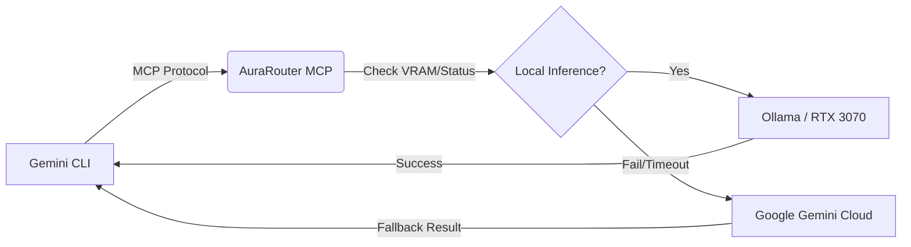

# AuraRouter: Intelligent Local-First Code Gateway

**Current Status:** Functional Prototype (Feb 2026)  
**Maintainer:** Steven Siebert / AuraCore Dynamics  

## Overview

AuraRouter is a Model Context Protocol (MCP) server designed to bridge the gap between local compute and cloud reliability. It allows the Gemini CLI (or any MCP client) to route heavy code generation tasks to a local LLM (ie DeepSeek-Coder-V2) instance running on consumer hardware (ie RTX 3070), automatically falling back to the **Google Gemini API** if the local model chokes, hallucinates, or times out. This shares conceptual lineage with AuraXLM but is significantly simplified for very basic AI sovereignty requirements.

This is designed to save tokens on the cloud side while utilizing local hardware for the grunt work.

## Architecture



## Hardware Requirements

* **GPU:** NVIDIA RTX 3070 (8GB VRAM) or better recommended.
* **RAM:** 32GB System RAM (Ollama will offload layers if VRAM fills up).
* **Disk:** ~10GB for model weights.

## Prerequisites

1. **Ollama**: Must be installed and running.
2. **Conda**: For environment management.
3. **Google AI Studio Key**: For the fallback safety net.

## Installation

### 1. Clone & Env Setup

Use the included `environment.yaml` to build the isolated Python 3.12 environment.

```bash
conda env create -f environment.yaml
conda activate aurarouter

```

### 2. Pull the Local Model

We use `deepseek-coder-v2:lite` (approx 16B params) which fits comfortably in a split VRAM/RAM configuration on a 3070.

```bash
ollama pull deepseek-coder-v2:lite

```

### 3. Configuration

Create a `.env` file in the project root to store your fallback credentials.

```bash
echo "GOOGLE_API_KEY=AIzaSyYourKeyHere..." > .env

```

## Usage

### Running the Server

Start the MCP server. It listens on stdio by default (unless modified for SSE).

```bash
# Direct run
python aurarouter.py

```

### connecting to Gemini CLI

Add the server to your Gemini CLI configuration (usually `~/.geminichat/config.json` or similar, depending on version/wrapper).

**JSON Config Example:**

```json
{
  "mcpServers": {
    "aurarouter": {
      "command": "python",
      "args": ["/abs/path/to/aurarouter/aurarouter.py"],
      "env": {
        "GOOGLE_API_KEY": "YOUR_KEY_IF_NOT_USING_DOTENV"
      }
    }
  }
}

```

## Functionality

The server exposes a single, robust tool: `intelligent_code_gen`.

* **Input:** Task description, File Context, Language.
* **Logic:**
1. Constructs a strict engineering prompt.
2. Hits `http://localhost:11434` (Ollama).
3. Checks if output is valid (length check).
4. **Fallback:** If Ollama fails, hits `gemini-2.0-flash` via Google GenAI SDK.


* **Output:** Pure code block. No conversational fluff.

## Troubleshooting

* **OOM Errors:** If the 3070 crashes, check `aurarouter.py` and lower `num_ctx` in the Ollama options (currently set to 4096).
* **Slow Inference:** If the token speed drops to <5 t/s, you are spilling too much into system RAM. Switch to a smaller quantization or 7B model.
* **Logs:** The script uses standard logging. Run manually to see `⚡ [LOCAL]` vs `☁️ [CLOUD]` decision making.

## License

Copyright 2026 AuraCore Dynamics Inc.
