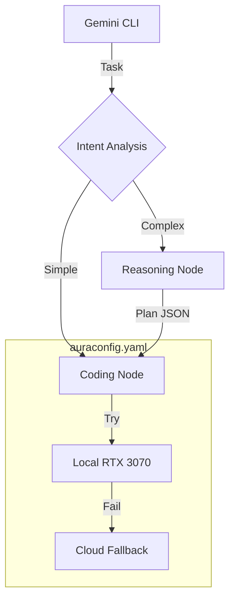

# AuraRouter: The AuraXLM-Lite Compute Fabric

**Current Status:** Production Prototype v3 (Feb 2026)  
**Maintainer:** Steven Siebert / AuraCore Dynamics  

## Overview

AuraRouter implements a simplified role-based configurable xLM (SLM/TLM/LLM) prompt routing as an MCP server. AuraRouter is designed to orchestrate local and cloud resources for AuraCore development. It acts as an intelligent middleware for an MCP Client (ie Gemini CLI), allowing you to route code generation tasks to local hardware while maintaining a cloud safety net.

It implements an **Intent -> Plan -> Execute** loop:
1.  **Router:** A fast local model classifies the task (Simple vs. Complex).
2.  **Architect:** If complex, a reasoning model generates a sequential execution plan.
3.  **Worker:** A coding model executes the plan step-by-step.

## AuraGrid Integration (Optional)

AuraRouter can also be deployed as a **Managed Application Service (MAS)** on [AuraGrid](https://github.com/auracoredynamics/auragrid), enabling distributed access to routing services across a federated compute fabric.

**Features:**
- Deploy aurarouter as a grid-native service (every node or cell-scoped singleton)
- Expose routing, reasoning, and code generation as discoverable grid services
- Call via synchronous gRPC proxy or asynchronous event publishing
- Full backwards compatibility—works standalone without AuraGrid

**Getting Started:**
```bash
# Install with AuraGrid support
pip install aurarouter[auragrid]

# Deploy via AuraGrid manifest
cp manifests/auragrid_manifest.json /path/to/auragrid/manifests/
```

See [AURAGRID.md](AURAGRID.md) for complete integration guide, configuration options, service API reference, and usage examples.

## Architecture



## Prerequisites

* **Python 3.12+**
* **Ollama** (Running locally with `qwen2.5-coder:7b` or similar)
* **Google AI Studio Key** (For cloud fallback/reasoning)

## Installation

### 1. Environment Setup

Create the isolated environment with the required dependencies.

```bash
conda env create -f environment.yaml
conda activate aurarouter

```

### 2. Pull Local Models

We recommend the **Qwen 2.5** series for consumer hardware speed/stability.

```bash
ollama pull qwen2.5-coder:7b

```

### 3. Configuration

Edit `auraconfig.yaml` to define your nodes and paste your API keys.

```yaml
models:
  local_3070:
    provider: ollama
    endpoint: http://localhost:11434/api/generate
    model_name: qwen2.5-coder:7b

  cloud_gemini:
    provider: google
    model_name: gemini-2.0-flash
    api_key: "AIzaSy..." # Paste key here

```

### 4. Register AuraRouter CLI Tools

AuraRouter can integrate with your Gemini CLI to provide advanced routing capabilities. Choose from the following options to register the necessary tools:

*   **Interactive Installation (Recommended):**
    Run the interactive installer to register support for all available models (Gemini and Claude). You will be prompted to confirm or skip installation for each.

    ```bash
    python aurarouter.py --install
    ```

*   **Gemini-only Installation:**
    Register AuraRouter specifically for Gemini models.

    ```bash
    python aurarouter.py --install-gemini
    ```

*   **Claude-only Installation:**
    Register AuraRouter specifically for Claude models.

    ```bash
    python aurarouter.py --install-claude
    ```

## Usage

Restart your Gemini CLI. You can now use natural language to trigger the fabric.

**The "Fast Lane" (Local Only):**

> "Write a python function to calculate Fibonacci."
> *(Routes directly to Local Qwen)*

**The "Heavy Lane" (Cloud Plan + Local Build):**

> "Create a distributed lock manager in C# with an interface and unit tests."
> *(Routes to Cloud Architect for planning, then Local Qwen for execution)*

## Scaling Guide
When you add new on-prem xLM resources:

1. Open `auraconfig.yaml`.
2. Uncomment the `local_3090_deepseek` block under `models`.
3. Add it to the top of the `reasoning` role list.
4. Restart the router. **No code changes required.**

## Troubleshooting

* **"Empty response received":** The local model is likely OOMing or timing out. Check the `timeout` setting in `auraconfig.yaml`.
* **"Model not found":** Ensure the `model_name` in YAML matches `ollama list` exactly.
* **Installer fails:** Manually add the `mcpServers` block to your `~/.geminichat/settings.json` pointing to the `aurarouter.py` absolute path.

## License

Copyright 2026 AuraCore Dynamics Inc.
