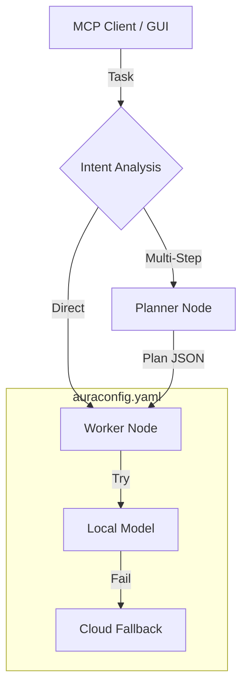

# AuraRouter: The AuraXLM-Lite Compute Fabric

**Current Status:** Production Prototype v4 (Feb 2026)
**Maintainer:** Steven Siebert / AuraCore Dynamics

## Overview

AuraRouter implements a role-based configurable xLM (SLM/TLM/LLM) prompt routing fabric. It acts as intelligent middleware that routes tasks across local and cloud models with automatic fallback. AuraRouter is content-agnostic -- it handles code generation, summarization, analysis, RAG-enabled Q&A, and any other prompt-based work. It can run as an MCP server, a desktop GUI application, or a managed service on AuraGrid.

It implements an **Intent -> Plan -> Execute** loop:
1.  **Classifier:** A fast local model classifies the task (Direct vs. Multi-Step).
2.  **Planner:** If multi-step, a reasoning model generates a sequential execution plan.
3.  **Worker:** An execution model carries out the plan step-by-step.

## Architecture



## Installation

### PyPI (Recommended)

```bash
# Core install (MCP server + GUI + cloud providers + llamacpp-server HTTP provider)
pip install aurarouter

# With embedded llama.cpp + HuggingFace model downloading
pip install aurarouter[local]

# Everything (local + AuraGrid + dev tools)
pip install aurarouter[all]
```

### Source Install

```bash
git clone https://github.com/auracoredynamics/aurarouter.git
cd aurarouter
pip install -r requirements.txt        # Core dependencies
pip install -r requirements-local.txt   # Optional: local inference deps
pip install -e .                        # Editable install
```

### Conda

```bash
conda env create -f environment.yaml
conda activate aurarouter
```

See [DEPLOYMENT.md](DEPLOYMENT.md) for detailed deployment and configuration guide.

## Quick Start

### 1. Configuration

Run the interactive installer to create a config template:

```bash
aurarouter --install
```

Or manually create `~/.auracore/aurarouter/auraconfig.yaml`:

```yaml
models:
  local_qwen:
    provider: ollama
    endpoint: http://localhost:11434/api/generate
    model_name: qwen2.5-coder:7b

  cloud_gemini:
    provider: google
    model_name: gemini-2.0-flash
    api_key: "AIzaSy..."

roles:
  router:   [local_qwen, cloud_gemini]
  reasoning: [cloud_gemini]
  coding:   [local_qwen, cloud_gemini]

# Optional: semantic verb synonyms for intent classification
semantic_verbs:
  coding:
    synonyms: [programming, code generation, developer]
  reasoning:
    synonyms: [planner, architect, planning]
```

### 2. Run

```bash
# MCP server (default)
aurarouter

# Desktop GUI
aurarouter gui

# With explicit config
aurarouter --config /path/to/auraconfig.yaml
```

## Providers

| Provider | Type | Config Key | Dependencies |
|----------|------|------------|--------------|
| Ollama | Local HTTP | `ollama` | None (uses httpx) |
| llama.cpp Server | Local HTTP | `llamacpp-server` | None (uses httpx) |
| llama.cpp Embedded | Local Native | `llamacpp` | `pip install aurarouter[local]` |
| OpenAPI-Compatible | Local/Cloud HTTP | `openapi` | None (uses httpx) |
| Google Gemini | Cloud | `google` | Included |
| Anthropic Claude | Cloud | `claude` | Included |

The **OpenAPI** provider works with any OpenAI-compatible API endpoint (vLLM, text-generation-inference, LocalAI, LM Studio, etc.).

## GUI

The desktop GUI (included in the base install) provides:

- **Singleton enforcement** — Only one AuraRouter instance runs at a time; subsequent launches detect the existing instance
- **Environment selector** — Switch between Local and AuraGrid deployments at runtime
- **Service controls** — Start, stop, and pause the MCP server or AuraGrid MAS
- **Model loading progress** — Visual progress indicator when local GPU models are loading
- **Execute tab** — Task input with file attachment, DAG execution visualization, task output
- **Models tab** — Local GGUF model browser, HuggingFace downloads, local file import, grid model listing (AuraGrid)
- **Configuration tab** — Model CRUD with capability tags, fallback chain editor with known roles, semantic verb configuration, YAML preview, cell-wide save warnings (AuraGrid)
- **Grid panels (AuraGrid)** — Deployment strategy editor, cell node status, event log
- **Health dashboard** — Per-model health status with clickable indicator (state-aware: reports correctly when service is stopped)
- **Privacy-aware routing** — Automatically re-routes prompts containing PII away from cloud models to local/private-tagged models
- **Prompt history** — Last 20 tasks with results, restorable from dropdown
- **Keyboard shortcuts** — Ctrl+Enter (execute), Ctrl+N (new), Escape (cancel)

All configuration changes are persisted to `auraconfig.yaml`. See [GUI_GUIDE.md](GUI_GUIDE.md) for the complete guide.

## CLI Commands

| Command | Description |
|---------|-------------|
| `aurarouter` | Run MCP server (default) |
| `aurarouter gui` | Launch desktop GUI |
| `aurarouter download-model --repo REPO --file FILE` | Download GGUF model from HuggingFace |
| `aurarouter list-models` | List locally downloaded GGUF models |
| `aurarouter remove-model --file FILE` | Remove a downloaded model |
| `aurarouter --install` | Interactive installer for MCP clients |
| `aurarouter --install-gemini` | Register for Gemini CLI |
| `aurarouter --install-claude` | Register for Claude |

## MCP Tools

### Dynamic Model Registration

External services can register new GGUF models via the `aurarouter.assets.register` MCP tool:

```python
# Example: Register a fine-tuned model
result = mcp_client.call_tool("register_asset", {
    "model_id": "my-finetuned-qwen",
    "file_path": "/path/to/model.gguf",
    "repo": "myorg/my-finetuned-model",
    "tags": "coding,local,fine-tuned"
})
```

After registration, add the model to a role chain and restart the MCP server to enable routing.

### Asset Discovery

Query available local GGUF files via the `aurarouter.assets.list` MCP tool:

```python
# List all downloaded models
result = mcp_client.call_tool("list_assets", {})
```

Returns a JSON array of asset entries with repo, filename, path, size, and metadata.

## AuraGrid Integration (Optional)

AuraRouter can be deployed as a **Managed Application Service (MAS)** on [AuraGrid](https://github.com/auracoredynamics/auragrid) for distributed access to routing services.

```bash
pip install aurarouter[auragrid]
```

See [AURAGRID.md](AURAGRID.md) for the complete integration guide.

## Scaling Guide

When you add new on-prem xLM resources:

1. Open `auraconfig.yaml` (or use the GUI Configuration tab).
2. Add the new model under `models`.
3. Add it to the appropriate role chain under `roles`.
4. Restart the router (or save from the GUI). **No code changes required.**

## Troubleshooting

* **"Empty response received":** The local model is likely OOMing or timing out. Check the `timeout` setting in `auraconfig.yaml`.
* **"Model not found":** Ensure the `model_name` in YAML matches `ollama list` exactly.
* **"huggingface-hub is required":** Run `pip install aurarouter[local]` to enable model downloading and embedded llama.cpp.
* **PySide6 issues on headless servers:** PySide6 is a core dependency. On headless/server-only deployments, use the MCP server mode (`aurarouter`) which does not launch the GUI.

## License

Copyright 2026 AuraCore Dynamics Inc.
