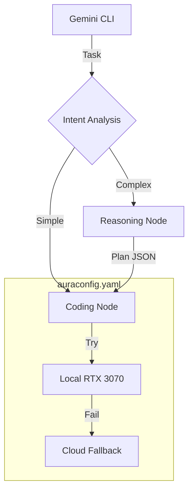

# AuraRouter: The AuraXLM-Lite Compute Fabric

**Current Status:** Functional Prototype v2 (Feb 2026)  
**Maintainer:** Steven Siebert / AuraCore Dynamics  

## Overview

AuraRouter is not just a fallback script; it is a **Role-Based Compute Fabric** designed to orchestrate local and cloud resources for AuraCore development. 

It implements an **Intent -> Plan -> Execute** loop:
1.  **Router:** A fast local model classifies the task (Simple vs. Complex).
2.  **Architect:** If complex, a reasoning model generates a sequential execution plan.
3.  **Worker:** A coding model executes the plan step-by-step.

It allows you to treat your RTX 3070, future 3090, and Google Cloud as a unified pool of "Nodes" assigned to specific "Roles."

## Architecture



## Prerequisites

* **Python 3.12+**
* **Ollama** (Running locally)
* **Google AI Studio Key** (For cloud fallback/reasoning)

## Installation

### 1. Environment Setup

The stack has been simplified. We now use `PyYAML` for configuration.

```bash
# Update existing env
conda activate aurarouter
pip install pyyaml mcp[cli] httpx google-genai

# OR create fresh
conda env create -f environment.yaml

```

### 2. Pull Local Models

We recommend the **Qwen 2.5** series for consumer hardware speed/stability.

```bash
ollama pull qwen2.5-coder:7b

```

## Configuration: `auraconfig.yaml`

We have removed `.env`. All configuration happens in `auraconfig.yaml`.

### 1. Define Your Nodes (Models)

List every compute resource available to you. You can paste API keys directly here.

```yaml
models:
  local_3070:
    provider: ollama
    endpoint: http://localhost:11434/api/generate
    model_name: qwen2.5-coder:7b

  cloud_gemini:
    provider: google
    model_name: gemini-2.0-flash
    api_key: "AIzaSy..." # Paste key here

```

### 2. Assign Roles

Define the priority chain for each role. The router tries the first model, then fails over to the next.

```yaml
roles:
  # Who decides if a task is hard?
  router:
    - local_3070
    - cloud_gemini

  # Who writes the code?
  coding:
    - local_3070
    - cloud_gemini

```

## Usage

### Running the Server

```bash
python aurarouter.py

```

### Connecting to Gemini CLI

Add the server to your Gemini CLI configuration (e.g., `~/.geminichat/config.json`).

```json
{
  "mcpServers": {
    "aurarouter": {
      "command": "python",
      "args": ["/abs/path/to/aurarouter.py"]
    }
  }
}

```

## Scaling Guide (Adding the 3090)

When your 3090 server comes online:

1. Open `auraconfig.yaml`.
2. Uncomment the `local_3090_deepseek` block under `models`.
3. Add it to the top of the `reasoning` role list.
4. Restart the router. **No code changes required.**

## Troubleshooting

* **"Empty response received":** The local model is likely OOMing or timing out. Check the `timeout` setting in `auraconfig.yaml`.
* **"Model not found":** Ensure the `model_name` in YAML matches `ollama list` exactly.
* **API Key Errors:** If you don't want to paste the key in YAML, use `env_key: GOOGLE_API_KEY` and export it in your shell.

## License

Copyright 2026 AuraCore Dynamics Inc.
