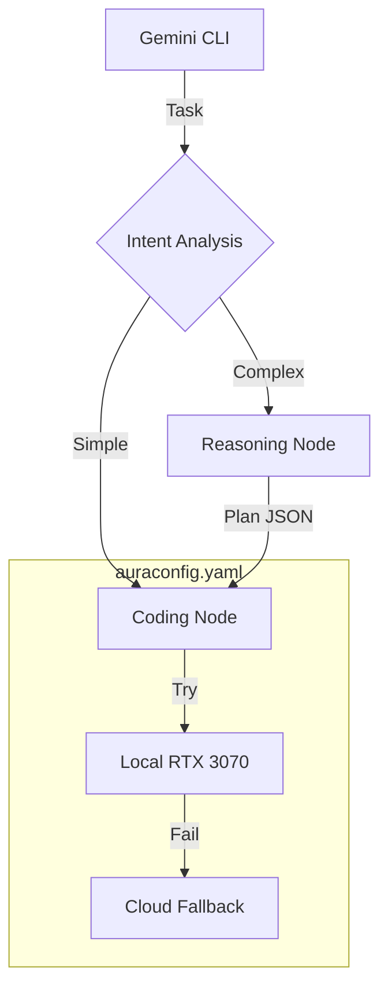

# AuraRouter: The AuraXLM-Lite Compute Fabric

**Current Status:** Production Prototype v3 (Feb 2026)  
**Maintainer:** Steven Siebert / AuraCore Dynamics  

## Overview

AuraRouter is a **Role-Based Compute Fabric** designed to orchestrate local and cloud resources for AuraCore development. It acts as an intelligent middleware for the Gemini CLI, allowing you to route code generation tasks to local hardware (RTX 3070/3090) while maintaining a cloud safety net.

It implements an **Intent -> Plan -> Execute** loop:
1.  **Router:** A fast local model classifies the task (Simple vs. Complex).
2.  **Architect:** If complex, a reasoning model generates a sequential execution plan.
3.  **Worker:** A coding model executes the plan step-by-step.

## Architecture



## Prerequisites

* **Python 3.12+**
* **Ollama** (Running locally with `qwen2.5-coder:7b` or similar)
* **Google AI Studio Key** (For cloud fallback/reasoning)

## Installation

### 1. Environment Setup

Create the isolated environment with the required dependencies.

```bash
conda env create -f environment.yaml
conda activate aurarouter

```

### 2. Pull Local Models

We recommend the **Qwen 2.5** series for consumer hardware speed/stability.

```bash
ollama pull qwen2.5-coder:7b

```

### 3. Configuration

Edit `auraconfig.yaml` to define your nodes and paste your API keys.

```yaml
models:
  local_3070:
    provider: ollama
    endpoint: http://localhost:11434/api/generate
    model_name: qwen2.5-coder:7b

  cloud_gemini:
    provider: google
    model_name: gemini-2.0-flash
    api_key: "AIzaSy..." # Paste key here

```

### 4. Auto-Registration

Run the installer to inject AuraRouter into your Gemini CLI settings.

```bash
python aurarouter.py --install

```

*Follow the prompts to auto-detect your `settings.json`.*

## Usage

Restart your Gemini CLI. You can now use natural language to trigger the fabric.

**The "Fast Lane" (Local Only):**

> "Write a python function to calculate Fibonacci."
> *(Routes directly to Local Qwen)*

**The "Heavy Lane" (Cloud Plan + Local Build):**

> "Create a distributed lock manager in C# with an interface and unit tests."
> *(Routes to Cloud Architect for planning, then Local Qwen for execution)*

## Scaling Guide (Adding the 3090)

When your 3090 server comes online:

1. Open `auraconfig.yaml`.
2. Uncomment the `local_3090_deepseek` block under `models`.
3. Add it to the top of the `reasoning` role list.
4. Restart the router. **No code changes required.**

## Troubleshooting

* **"Empty response received":** The local model is likely OOMing or timing out. Check the `timeout` setting in `auraconfig.yaml`.
* **"Model not found":** Ensure the `model_name` in YAML matches `ollama list` exactly.
* **Installer fails:** Manually add the `mcpServers` block to your `~/.geminichat/settings.json` pointing to the `aurarouter.py` absolute path.

## License

Copyright 2026 AuraCore Dynamics Inc.
