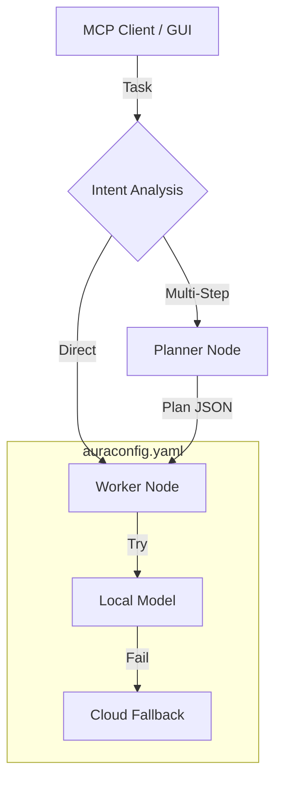

# AuraRouter: The AuraXLM-Lite Compute Fabric

**Current Status:** Production Prototype v3.1 (Mar 2026)
**Maintainer:** Steven Siebert / AuraCore Dynamics

## Overview

AuraRouter implements a role-based configurable xLM (SLM/TLM/LLM) prompt routing fabric. It acts as intelligent middleware that routes tasks across local and cloud models with automatic fallback. AuraRouter is content-agnostic -- it handles code generation, summarization, analysis, RAG-enabled Q&A, and any other prompt-based work. It can run as an MCP server, a desktop GUI application, or a managed service on AuraGrid.

It implements an **Intent -> Plan -> Execute** loop:
1.  **Classifier:** A fast local model classifies the task (Direct vs. Multi-Step).
2.  **Planner:** If multi-step, a reasoning model generates a sequential execution plan.
3.  **Worker:** An execution model carries out the plan step-by-step.

## Architecture


```mermaid
graph TD
    User[MCP Client / GUI] -->|Task| Classifier{Intent Analysis}
    Classifier -->|Direct| Worker[Worker Node]
    Classifier -->|Multi-Step| Planner[Planner Node]
    Planner -->|Plan JSON| Worker

    subgraph Compute Fabric [auraconfig.yaml]
        Worker -->|Try| Node1[Local Model]
        Node1 -->|Fail| Node2[Cloud Fallback]
    end
```

## Installation

### PyPI (Recommended)

```bash
# Core install (MCP server + GUI + llamacpp-server HTTP provider)
pip install aurarouter

# With embedded llama.cpp + HuggingFace model downloading
pip install aurarouter[local]

# Everything (local + AuraGrid + dev tools)
pip install aurarouter[all]
```

### Source Install

```bash
git clone https://github.com/auracoredynamics/aurarouter.git
cd aurarouter
pip install -r requirements.txt        # Core dependencies
pip install -r requirements-local.txt   # Optional: local inference deps
pip install -e .                        # Editable install
```

### Conda

```bash
conda env create -f environment.yaml
conda activate aurarouter
```

See [DEPLOYMENT.md](DEPLOYMENT.md) for detailed deployment and configuration guide.

## Quick Start

### 1. Configuration

Run the interactive installer to create a config template:

```bash
aurarouter --install
```

Or manually create `~/.auracore/aurarouter/auraconfig.yaml`:

```yaml
models:
  local_qwen:
    provider: ollama
    endpoint: http://localhost:11434/api/generate
    model_name: qwen2.5-coder:7b

roles:
  router:   [local_qwen]
  reasoning: [local_qwen]
  coding:   [local_qwen]
```

### 2. Run

```bash
# MCP server (default)
aurarouter

# Desktop GUI
aurarouter gui

# With explicit config
aurarouter --config /path/to/auraconfig.yaml
```

## Provider Architecture

AuraRouter 0.3.1 separates providers into **built-in** (bundled) and **external** (MCP server packages).

### Built-in Providers

| Provider | Type | Config Key | Dependencies |
|----------|------|------------|--------------|
| Ollama | Local HTTP | `ollama` | None (uses httpx) |
| llama.cpp Server | Local HTTP | `llamacpp-server` | None (uses httpx) |
| llama.cpp Embedded | Local Native | `llamacpp` | `pip install aurarouter[local]` |
| OpenAPI-Compatible | Local/Cloud HTTP | `openapi` | None (uses httpx) |

All built-in providers implement `ProviderProtocol` and are auto-discovered by the provider catalog.

### External MCP Provider Packages

Proprietary cloud providers are distributed as separate MCP server packages, managed through the provider catalog:

- **aurarouter-claude** -- Anthropic Claude provider (MCP server)
- **aurarouter-gemini** -- Google Gemini provider (MCP server)

External providers are connected via `MCPProvider`, which wraps any MCP-compatible server as a standard AuraRouter provider. The `openapi` built-in provider can also serve as a fallback for any endpoint implementing the OpenAI chat completions API.

### Provider Template

A starter template for building custom external providers is included at `src/aurarouter/providers/template/`.

## GUI (v0.3.1 — Redesigned)

The desktop GUI uses a sidebar-driven layout with six main sections:

- **Workspace** — Three-column task execution panel: history sidebar, task input with DAG visualizer and syntax-highlighted output, context/settings sidebar
- **Routing** — Visual flowchart editor for role-to-model fallback chains with drag-and-drop reordering and triage preview
- **Models** — Unified model manager with card-based layout, provider catalog, health badges, and HuggingFace downloads
- **Monitor** — Observability dashboard with sub-tabs: Overview, Traffic, Privacy, Health
- **Settings** — Five collapsible sections: MCP tools, budget, privacy, YAML editor, and system
- **Help** — Searchable contextual help browser with onboarding wizard for first-time users
- **Grid panels (AuraGrid)** — Deployment strategy editor, cell node status, event log

Features:
- **Environment selector** — Switch between Local and AuraGrid deployments at runtime
- **Service controls** — Start, stop, and pause the MCP server or AuraGrid MAS
- **Provider catalog** — Discover, start, stop, and health-check built-in and external MCP providers
- **Keyboard shortcuts** — Ctrl+Enter (execute), Ctrl+N (new), Escape (cancel), Ctrl+1-6 (sections), F1 (help), Ctrl+, (settings)

All configuration changes are persisted to `auraconfig.yaml`. See [GUI_GUIDE.md](GUI_GUIDE.md) for the complete guide.

## CLI Commands

| Command | Description |
|---------|-------------|
| `aurarouter` | Run MCP server (default) |
| `aurarouter gui` | Launch desktop GUI |
| `aurarouter model list` | List all configured models |
| `aurarouter model add ID --provider P` | Add a new model |
| `aurarouter model edit ID [--provider] [--endpoint]` | Edit an existing model |
| `aurarouter model remove ID` | Remove a model |
| `aurarouter model test ID` | Test model connectivity |
| `aurarouter model auto-tune ID` | Auto-tune model parameters |
| `aurarouter route list` | List routing roles and chains |
| `aurarouter route set ROLE MODEL...` | Set a role's fallback chain |
| `aurarouter route append ROLE MODEL` | Append a model to a chain |
| `aurarouter route remove-model ROLE MODEL` | Remove a model from a chain |
| `aurarouter route delete ROLE` | Delete a role |
| `aurarouter run TASK` | Execute a task through the IPE loop |
| `aurarouter compare PROMPT --models A,B` | Compare output across models |
| `aurarouter traffic [--range 24h]` | Show traffic and usage statistics |
| `aurarouter privacy [--range 7d]` | Show privacy audit events |
| `aurarouter health [MODEL]` | Check model health |
| `aurarouter budget` | Show budget status |
| `aurarouter config show` | Show current configuration |
| `aurarouter config set KEY VALUE` | Set a configuration value |
| `aurarouter config mcp-tool TOOL --enable/--disable` | Toggle MCP tools |
| `aurarouter config save` | Save configuration to disk |
| `aurarouter config reload` | Reload configuration from disk |
| `aurarouter catalog list` | List provider catalog |
| `aurarouter catalog add NAME --endpoint URL` | Add a provider |
| `aurarouter catalog remove NAME` | Remove a provider |
| `aurarouter catalog start NAME` | Start a provider |
| `aurarouter catalog stop NAME` | Stop a provider |
| `aurarouter catalog health [NAME]` | Check provider health |
| `aurarouter catalog discover NAME` | Discover models from a provider |
| `aurarouter --install` | Interactive installer for MCP clients |
| `aurarouter --install-gemini` | Register for Gemini CLI |
| `aurarouter download-model --repo REPO --file FILE` | Download GGUF model (legacy) |
| `aurarouter list-models` | List downloaded GGUF models (legacy) |
| `aurarouter remove-model --file FILE` | Remove a downloaded model (legacy) |

All commands support `--json` for machine-readable output and `--config` for custom config paths.

## AuraGrid Integration (Optional)

AuraRouter can be deployed as a **Managed Application Service (MAS)** on [AuraGrid](https://github.com/auracoredynamics/auragrid) for distributed access to routing services.

```bash
pip install aurarouter[auragrid]
```

See [AURAGRID.md](AURAGRID.md) for the complete integration guide.

## Scaling Guide

When you add new on-prem xLM resources:

1. Open `auraconfig.yaml` (or use the GUI Configuration tab).
2. Add the new model under `models`.
3. Add it to the appropriate role chain under `roles`.
4. Restart the router (or save from the GUI). **No code changes required.**

## Troubleshooting

* **"Empty response received":** The local model is likely OOMing or timing out. Check the `timeout` setting in `auraconfig.yaml`.
* **"Model not found":** Ensure the `model_name` in YAML matches `ollama list` exactly.
* **"huggingface-hub is required":** Run `pip install aurarouter[local]` to enable model downloading and embedded llama.cpp.
* **PySide6 issues on headless servers:** PySide6 is a core dependency. On headless/server-only deployments, use the MCP server mode (`aurarouter`) which does not launch the GUI.

## License

Copyright 2026 AuraCore Dynamics Inc.
