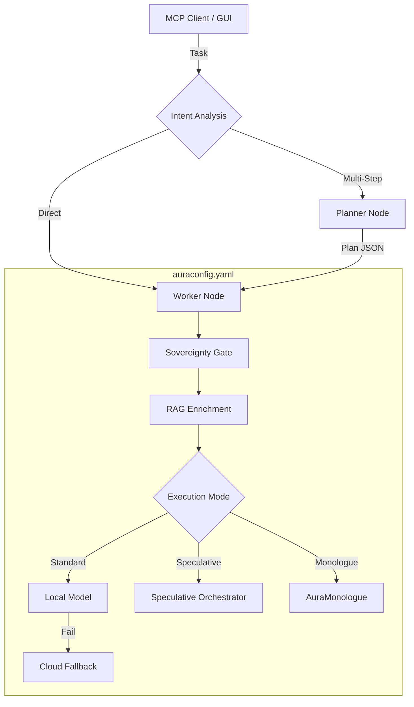

# AuraRouter: The AuraXLM-Lite Compute Fabric

**Current Status:** Production Prototype v0.5.5 (Apr 2026)
**Maintainer:** Steven Siebert / AuraCore Dynamics

## Overview

AuraRouter implements a role-based configurable xLM (SLM/TLM/LLM) prompt routing fabric. It acts as intelligent middleware that routes tasks across local and cloud models with automatic fallback. AuraRouter is content-agnostic -- it handles code generation, summarization, analysis, RAG-enabled Q&A, and any other prompt-based work. It can run as an MCP server, a desktop GUI application, or a managed service on AuraGrid.

Recent FMoE work extends AuraRouter with five major additions:

- **Savings Telemetry & ROI Visualization**: Automated tracking of counterfactual USD savings and complexity scoring for locally-routed tasks, visualized via a dedicated desktop dashboard.
- **RAG enrichment** via AuraXLM MCP search before execution when enabled
- **Automatic sovereignty enforcement** that forces local-only execution or blocks unsafe requests
- **Speculative decoding orchestration** with notional streaming and verifier-driven correction events
- **AuraMonologue** recursive multi-expert reasoning using MAS-scored latent anchors and a reasoning blackboard

It implements an **Intent -> Plan -> Execute** loop:
1.  **Classifier:** A fast local model classifies the task (Direct vs. Multi-Step).
2.  **Planner:** If multi-step, a reasoning model generates a sequential execution plan.
3.  **Worker:** An execution model carries out the plan step-by-step.

**New in 0.5.1 — Unified Artifact Catalog:** Models, services, and analyzers are now managed through a single typed `catalog` section in `auraconfig.yaml`. Route analyzers are first-class orchestration primitives that let external systems (e.g., AuraXLM) take over routing decisions via MCP callback. A built-in `aurarouter-default` analyzer wraps the existing IPE pipeline. Legacy configs continue to work unchanged. See [CHANGELOG.md](CHANGELOG.md) for full details.

## Architecture


```mermaid
graph TD
    User[MCP Client / GUI] -->|Task| Classifier{Intent Analysis}
    Classifier -->|Direct| Worker[Worker Node]
    Classifier -->|Multi-Step| Planner[Planner Node]
    Planner -->|Plan JSON| Worker

    subgraph Compute Fabric [auraconfig.yaml]
    Worker --> Sovereignty[Sovereignty Gate]
    Sovereignty --> RAG[RAG Enrichment]
    RAG --> Exec{Execution Mode}
    Exec -->|Standard| Node1[Local Model]
    Exec -->|Speculative| Spec[Speculative Orchestrator]
    Exec -->|Monologue| Mono[AuraMonologue]
    Node1 -->|Fail| Node2[Cloud Fallback]
    end
```

## FMoE Execution Modes

AuraRouter supports three execution paths based on task complexity and configuration. See [EXECUTION_MODES.md](docs/EXECUTION_MODES.md) for a detailed architectural comparison of IPE vs. Monologue and Standalone vs. Grid operation.

| Mode | Trigger | Description |
|------|---------|-------------|
| **Standard** | Default | Existing role-chain execution with fallback and review loop |
| **Speculative** | High-complexity tasks when `system.speculative_decoding` is enabled | Drafter/verifier orchestration against AuraXLM with optional notional streaming |
| **Monologue** | Complex reasoning tasks when `system.monologue` is enabled | Recursive generator/critic/refiner loop with MAS-scored anchor retrieval |

Execution priority is `monologue > speculative > standard` when multiple modes are enabled.

## Installation

### PyPI (Recommended)

```bash
# Core install (MCP server + GUI + ONNX Intent Classification)
pip install aurarouter

# With embedded llama.cpp + HuggingFace model downloading
pip install aurarouter[local]
```

### Source Install

```bash
git clone https://github.com/auracoredynamics/aurarouter.git
cd aurarouter
pip install -r requirements.txt        # Core dependencies (includes ONNX + numpy)
pip install -r requirements-local.txt   # Optional: local inference deps
pip install -e .                        # Editable install
```

## Fast-Path Intent Classification

AuraRouter bundles a lightweight **ONNX sentence encoder** (`all-MiniLM-L6-v2`) for ultra-fast, local intent classification. This "Stage 2" analyzer provides deterministic, low-latency triage without requiring a full LLM for routing decisions.

The model and tokenizer are embedded directly in the package data, making AuraRouter fully functional in air-gapped environments immediately after installation.

---

## Quick Start

### 1. Configuration

Run the interactive installer to create a config template:

```bash
aurarouter --install
```

Or manually create `~/.auracore/aurarouter/auraconfig.yaml`:

```yaml
system:
  log_level: INFO
  default_timeout: 120.0
  active_analyzer: aurarouter-default   # Route analyzer to use (see catalog)
  rag_enrichment: true                  # Optional AuraXLM retrieval before execution
  sovereignty_enforcement: true         # Default-on local-only / blocked routing for sovereign content
  speculative_decoding: true            # Enable drafter/verifier orchestration
  monologue: true                       # Enable recursive multi-expert reasoning
  notional_confidence_threshold: 0.85   # Draft streaming gate for speculative execution

models:
  local_qwen:
    provider: ollama
    endpoint: http://localhost:11434/api/generate
    model_name: qwen2.5-coder:7b

roles:
  router:   [local_qwen]
  reasoning: [local_qwen]
  coding:   [local_qwen]

# Unified artifact catalog — models, services, and analyzers in one registry
catalog:
  aurarouter-default:
    kind: analyzer
    display_name: AuraRouter Default
    description: Intent classification with complexity-based triage routing
    provider: aurarouter
    analyzer_kind: intent_triage
    capabilities: [code, reasoning, review, planning]
    role_bindings:
      simple_code: coding
      complex_reasoning: reasoning
      review: reviewer
```

### 2. Run

```bash
# MCP server (default)
aurarouter

# Desktop GUI
aurarouter gui

# With explicit config
aurarouter --config /path/to/auraconfig.yaml
```

## Provider Architecture

AuraRouter 0.5.1 separates providers into **built-in** (bundled) and **external** (MCP server packages).

### Built-in Providers

| Provider | Type | Config Key | Dependencies |
|----------|------|------------|--------------|
| Ollama | Local HTTP | `ollama` | None (uses httpx) |
| llama.cpp Server | Local HTTP | `llamacpp-server` | None (uses httpx) |
| llama.cpp Embedded | Local Native | `llamacpp` | `pip install aurarouter[local]` |
| OpenAPI-Compatible | Local/Cloud HTTP | `openapi` | None (uses httpx) |

All built-in providers implement `ProviderProtocol` and are auto-discovered by the provider catalog.

### External MCP Provider Packages

Cloud providers are distributed as separate installable MCP server packages, discovered automatically through the `aurarouter.providers` entry-point group:

| Package | Provider | Models | Install |
|---------|----------|--------|---------|
| **aurarouter-claude** | Anthropic Claude | Opus 4, Sonnet 4, Haiku 4.5 | `pip install aurarouter-claude` |
| **aurarouter-gemini** | Google Gemini | 2.5 Pro, 2.5 Flash, 2.0 Flash | `pip install aurarouter-gemini` |

```bash
# Install one or both provider packages
pip install aurarouter-claude
pip install aurarouter-gemini

# Verify discovery
python -c "from importlib.metadata import entry_points; print([ep.name for ep in entry_points(group='aurarouter.providers')])"
```

External providers are connected via `MCPProvider`, which wraps any MCP-compatible server as a standard AuraRouter provider. The `openapi` built-in provider can also serve as a fallback for any endpoint implementing the OpenAI chat completions API.

### Provider Template

A starter template for building custom external providers is included at `src/aurarouter/providers/template/`.

## Unified Artifact Catalog

AuraRouter 0.5.1 introduces a **unified catalog** that manages three artifact kinds through a single `catalog` section in `auraconfig.yaml`. This catalog serves as a central registry for discovery by external tools and automated test suites.

See [docs/ARTIFACT_DISCOVERY.md](docs/ARTIFACT_DISCOVERY.md) for a complete guide on using the catalog for dynamic model discovery and testing integration.

| Kind | Description |
|------|-------------|
| **model** | An inference endpoint (local or remote). Legacy entries in the `models` section are automatically included as `kind: model`. |
| **service** | An external MCP service (e.g., an AuraGrid endpoint). |
| **analyzer** | A route analyzer that controls how tasks are classified and dispatched to models. |

Each artifact has a common schema: `artifact_id`, `kind`, `display_name`, `description`, `provider`, `version`, `tags`, `capabilities`, `status`, plus kind-specific `spec` fields that are merged at the top level in YAML.

The catalog is fully backwards-compatible. Existing `models` entries continue to work and appear as `kind: model` artifacts in catalog queries. New artifacts should be registered in the `catalog` section.

### Config Migration

To migrate an older config that lacks the `catalog` and `system.active_analyzer` sections:

```bash
aurarouter migrate-config --dry-run   # Preview changes
aurarouter migrate-config             # Apply in-place
```

Migration adds an empty `catalog` section, converts `grid_services.endpoints` into catalog service entries, and sets `system.active_analyzer` to `aurarouter-default`. Existing `models` and `roles` sections are never modified.

## Route Analyzers

Route analyzers are **FMoE (Federated Mixture-of-Experts) orchestration primitives** that sit above the model layer. They control how incoming tasks are classified, which role chain is selected, and how models are ranked — replacing or augmenting AuraRouter's built-in Intent-Plan-Execute pipeline.

**Built-in analyzer:** `aurarouter-default` wraps the existing IPE logic (intent classification with complexity-based triage routing). It is auto-registered in the catalog on server startup and set as the active analyzer if none is configured.

**Remote analyzers:** External systems (e.g., AuraXLM) can register as analyzers with an `mcp_endpoint` in their spec. When a remote analyzer is active, `route_task` delegates the routing decision to it via MCP JSON-RPC. If the remote analyzer fails or is unreachable, the built-in pipeline is used as fallback.

The active analyzer is controlled via:
- Config: `system.active_analyzer` in `auraconfig.yaml`
- MCP: `aurarouter.analyzer.set_active` / `aurarouter.analyzer.get_active`
- CLI: `aurarouter config set system.active_analyzer ANALYZER_ID`

## Sovereignty, RAG, and Reasoning

### Sovereignty Enforcement

AuraRouter now enforces sovereignty in the routing hot path. When configured patterns indicate PII or other sovereign content:

- local-only model chains are enforced automatically
- cloud execution is blocked when no compliant local chain exists
- response sanitization strips leaked sensitive content before returning results
- structured sovereignty audit events are emitted with a unified schema shared with AuraGrid and AuraXLM

### RAG Enrichment

When `system.rag_enrichment` is enabled, AuraRouter calls AuraXLM retrieval services before planning or execution and injects the retrieved context into the task prompt. Failures degrade cleanly back to the original prompt.

### AuraMonologue

AuraMonologue uses AuraXLM latent anchor retrieval and MAS scoring to qualify expert participation. Generator, critic, and refiner roles operate iteratively until critic approval, similarity convergence, or max-iteration cutoff.

## Intent Classification

**New in 0.5.5** -- AuraRouter uses an intent classification pipeline to determine how each task is routed. Intents map tasks to roles, which map to model chains.

### Built-in Intents

The following intents are always available regardless of which analyzer is active:

| Intent | Target Role | Description |
|--------|-------------|-------------|
| `DIRECT` | `coding` | Simple questions, jokes, or single-turn tasks that don't require code or multi-step reasoning |
| `SIMPLE_CODE` | `coding` | Straightforward code generation or implementation tasks |
| `COMPLEX_REASONING` | `reasoning` | Multi-step reasoning, architectural design, or complex analysis tasks |

### Custom Intents via Analyzers

Analyzers can declare additional domain-specific intents through their `role_bindings` spec field. Each key in `role_bindings` becomes a custom intent, and its value is the target role:

```yaml
catalog:
  my-domain-analyzer:
    kind: analyzer
    display_name: My Domain Analyzer
    analyzer_kind: intent_triage
    role_bindings:
      generate_code: coding
      edit_code: coding
      explain_code: reasoning
      review: reasoning
```

When this analyzer is active, its custom intents are registered alongside the built-in intents. Custom intents have higher priority and can override built-in intents of the same name.

Models can also declare `supported_intents` to indicate which intents they are best suited for:

```yaml
catalog:
  specialist-model:
    kind: model
    display_name: Code Specialist
    supported_intents: [generate_code, edit_code]
```

### CLI Intent Selection

Force a specific intent instead of auto-classification:

```bash
# List all available intents
aurarouter intent list

# Describe a specific intent
aurarouter intent describe SIMPLE_CODE

# Route with explicit intent
aurarouter run "Implement a REST API" --intent generate_code
```

### GUI Intent Selector

The workspace panel includes an intent combobox next to the Execute button. It lists "Auto (classify)" (default), all built-in intents, and any analyzer-declared intents grouped under the active analyzer's name. Select a specific intent to bypass auto-classification.

### MCP Tool

The `list_intents` MCP tool returns all available intents with their target roles and sources:

```json
{
  "active_analyzer": "aurarouter-default",
  "intents": [
    {"name": "DIRECT", "target_role": "coding", "source": "builtin", "description": "..."},
    {"name": "SIMPLE_CODE", "target_role": "coding", "source": "builtin", "description": "..."},
    {"name": "COMPLEX_REASONING", "target_role": "reasoning", "source": "builtin", "description": "..."}
  ]
}
```

For a complete guide to building analyzers with custom intents, see [docs/ANALYZER_GUIDE.md](docs/ANALYZER_GUIDE.md).

## GUI (v0.5.1 — Redesigned)

The desktop GUI uses a sidebar-driven layout with six main sections:

- **Workspace** — Three-column task execution panel: history sidebar, task input with DAG visualizer and syntax-highlighted output, context/settings sidebar
- **Routing** — Visual flowchart editor for role-to-model fallback chains with drag-and-drop reordering and triage preview
- **Models** — Unified model manager with card-based layout, provider catalog, health badges, and HuggingFace downloads
- **Monitor** — Observability dashboard with sub-tabs: Overview, Traffic, Privacy, Health, ROI & Telemetry
- **Settings** — Five collapsible sections: MCP tools, budget, privacy, YAML editor, and system
- **Help** — Searchable contextual help browser with onboarding wizard for first-time users
- **Grid panels (AuraGrid)** — Deployment strategy editor, cell node status, event log

Features:
- **Environment selector** — Switch between Local and AuraGrid deployments at runtime
- **Service controls** — Start, stop, and pause the MCP server or AuraGrid MAS
- **Provider catalog** — Discover, start, stop, and health-check built-in and external MCP providers
- **Keyboard shortcuts** — Ctrl+Enter (execute), Ctrl+N (new), Escape (cancel), Ctrl+1-6 (sections), F1 (help), Ctrl+, (settings)

All configuration changes are persisted to `auraconfig.yaml`. See [GUI_GUIDE.md](GUI_GUIDE.md) for the complete guide.

## CLI Commands

| Command | Description |
|---------|-------------|
| `aurarouter` | Run MCP server (default) |
| `aurarouter gui` | Launch desktop GUI |
| `aurarouter model list` | List all configured models |
| `aurarouter model add ID --provider P` | Add a new model |
| `aurarouter model edit ID [--provider] [--endpoint]` | Edit an existing model |
| `aurarouter model remove ID` | Remove a model |
| `aurarouter model test ID` | Test model connectivity |
| `aurarouter model auto-tune ID` | Auto-tune model parameters |
| `aurarouter route list` | List routing roles and chains |
| `aurarouter route set ROLE MODEL...` | Set a role's fallback chain |
| `aurarouter route append ROLE MODEL` | Append a model to a chain |
| `aurarouter route remove-model ROLE MODEL` | Remove a model from a chain |
| `aurarouter route delete ROLE` | Delete a role |
| `aurarouter run TASK` | Execute a task through the IPE loop |
| `aurarouter compare PROMPT --models A,B` | Compare output across models |
| `aurarouter traffic [--range 24h]` | Show traffic and usage statistics |
| `aurarouter privacy [--range 7d]` | Show privacy audit events |
| `aurarouter health [MODEL]` | Check model health |
| `aurarouter budget` | Show budget status |
| `aurarouter config show` | Show current configuration |
| `aurarouter config set KEY VALUE` | Set a configuration value |
| `aurarouter config mcp-tool TOOL --enable/--disable` | Toggle MCP tools |
| `aurarouter config save` | Save configuration to disk |
| `aurarouter config reload` | Reload configuration from disk |
| `aurarouter catalog list` | List provider catalog |
| `aurarouter catalog add NAME --endpoint URL` | Add a provider |
| `aurarouter catalog remove NAME` | Remove a provider |
| `aurarouter catalog start NAME` | Start a provider |
| `aurarouter catalog stop NAME` | Stop a provider |
| `aurarouter catalog health [NAME]` | Check provider health |
| `aurarouter catalog discover NAME` | Discover models from a provider |
| `aurarouter intent list` | List all available intents (built-in + analyzer-declared) |
| `aurarouter intent describe NAME` | Show details for a specific intent |
| `aurarouter run TASK --intent NAME` | Execute a task with a forced intent (skip auto-classification) |
| `aurarouter migrate-config [--dry-run]` | Migrate old config to current format (adds catalog, active_analyzer) |
| `aurarouter --install` | Interactive installer for MCP clients |
| `aurarouter --install-gemini` | Register for Gemini CLI |
| `aurarouter download-model --repo REPO --file FILE` | Download GGUF model (legacy) |
| `aurarouter list-models` | List downloaded GGUF models (legacy) |
| `aurarouter remove-model --file FILE` | Remove a downloaded model (legacy) |

All commands support `--json` for machine-readable output and `--config` for custom config paths.

## MCP Tools

The MCP server exposes the following tools to connected clients. Tools can be individually enabled/disabled in `auraconfig.yaml` under `mcp.tools`.

### Core Routing

| Tool | Description |
|------|-------------|
| `route_task` | Route a task through the IPE loop with automatic model fallback |
| `local_inference` | Execute on local/private models only (no cloud calls) |
| `generate_code` | Multi-step code generation with planning and review |
| `compare_models` | Run a prompt across multiple models and compare outputs |
| `list_models` | List all configured models with provider and endpoint info |

### Asset Management

| Tool | Description |
|------|-------------|
| `aurarouter.assets.list` | List physical GGUF model files in local storage |
| `aurarouter.assets.register` | Register a local GGUF file for immediate routing |
| `aurarouter.assets.register_remote` | Register a remote model endpoint for routing |
| `aurarouter.assets.unregister` | Remove a model from routing config (optionally delete file) |

### Unified Artifact Catalog

| Tool | Description |
|------|-------------|
| `aurarouter.catalog.list` | List catalog artifacts, optionally filtered by kind (`model`, `service`, `analyzer`) |
| `aurarouter.catalog.get` | Get details for a single catalog artifact by ID |
| `aurarouter.catalog.register` | Register a new artifact (model, service, or analyzer) in the catalog |
| `aurarouter.catalog.remove` | Remove an artifact from the catalog |

### Route Analyzers

| Tool | Description |
|------|-------------|
| `aurarouter.analyzer.set_active` | Set or clear the active analyzer for routing decisions |
| `aurarouter.analyzer.get_active` | Get the currently active analyzer ID |

### Intent Discovery

| Tool | Description |
|------|-------------|
| `list_intents` | List all available intents (built-in + analyzer-declared) with target roles and sources |

### Session Management (opt-in)

Session tools are registered when `sessions.enabled: true` in config: `create_session`, `session_message`, `session_status`, `list_sessions`, `delete_session`.

### Grid Service Tools (opt-in)

Grid tools are registered when `grid_services.endpoints` is configured: `list_grid_services`, `list_remote_tools`, `call_remote_tool`.

## AuraGrid Integration (Optional)

AuraRouter can be deployed as a **Managed Application Service (MAS)** on [AuraGrid](https://github.com/auracoredynamics/auragrid) for distributed access to routing services.

```bash
pip install aurarouter[auragrid]
```

See [AURAGRID.md](AURAGRID.md) for the complete integration guide.

## Scaling Guide

When you add new on-prem xLM resources:

1. Open `auraconfig.yaml` (or use the GUI Configuration tab).
2. Add the new model under `models`.
3. Add it to the appropriate role chain under `roles`.
4. Restart the router (or save from the GUI). **No code changes required.**

## Troubleshooting

* **"Empty response received":** The local model is likely OOMing or timing out. Check the `timeout` setting in `auraconfig.yaml`.
* **"Model not found":** Ensure the `model_name` in YAML matches `ollama list` exactly.
* **"huggingface-hub is required":** Run `pip install aurarouter[local]` to enable model downloading and embedded llama.cpp.
* **PySide6 issues on headless servers:** PySide6 is a core dependency. On headless/server-only deployments, use the MCP server mode (`aurarouter`) which does not launch the GUI.

## License

Copyright 2026 AuraCore Dynamics Inc.
